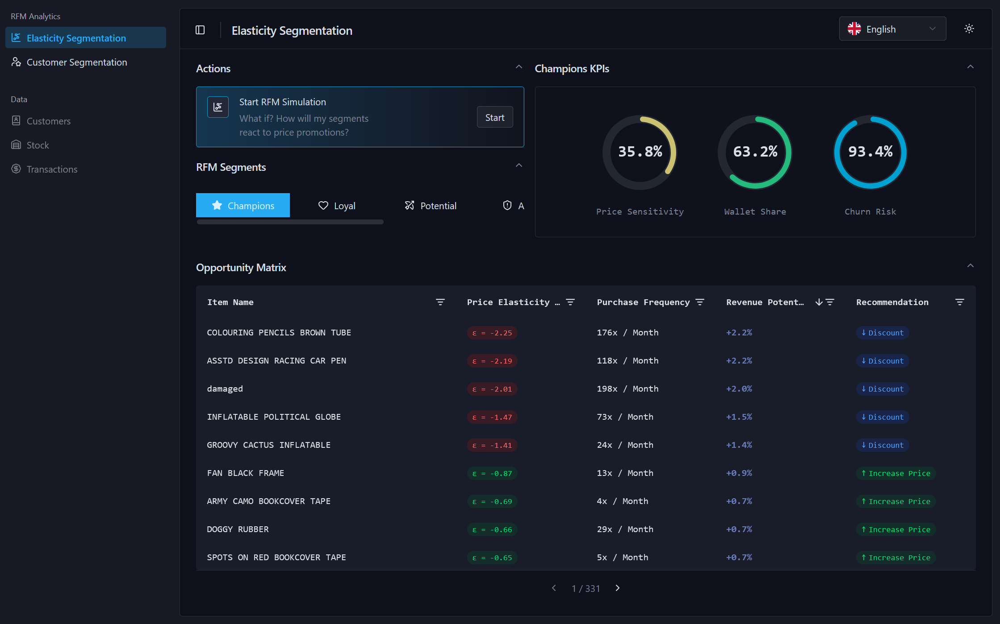

# 📊 elastix

> Mock Prototype Dynamic pricing dashboard for price elasticity analysis across RFM customer segments

[](https://react.dev)
[](https://typescriptlang.org)
[](https://vitejs.dev)
[](LICENSE)

## Live Demo
*Elastix* - https://elastix.vercel.app/
*Elastix-Api* - https://elastix-api.onrender.com/docs

## Dashboard Preview

<p align="center">
  
</p>

## Segment Elasticity Simulation

<p align="center">
  
</p>

## 🎯 What is elastix?

**elastix** is an interactive dashboard prototype for e-commerce managers to explore price elasticity within RFM (Recency, Frequency, Monetary) customer segments. It enables data-driven pricing decisions through:

- 📈 **Segment Visualization** — Treemap and Area Charts for customer distribution
- 🔮 **What-If Simulations** — Interactive price change scenarios
- 📊 **Revenue Projections** — Real-time impact analysis per segment
- 🎨 **Modern UI** — Built with shadcn/ui and Recharts

> 🎓 _Developed as part of a case study on dynamic pricing strategies in e-commerce_

---

## ✨ Features

| Feature               | Status | Description                         |
| --------------------- | ------ | ----------------------------------- |
| RFM Dashboard         | ✅     | Segment overview with KPIs          |
| Customer Segmentation | ✅     | Treemap & Area Chart visualizations |
| Simulation Dashboard  | ✅     | Price scenario modeling             |
| Stock Item Management | ✅     | Product selection per simulation    |
| Backend Integration   | 🔄     | RTK Query service layer             |

---

## 🚀 Quickstart

```bash
# Clone
git clone https://github.com/Mert-55/elastix.git
cd elastix

# Install
npm install

# Development
npm run dev
# → http://localhost:5173
```

### With Backend

```bash
# Start elastix-api first (see backend repo)
docker-compose up -d

# Then run frontend
npm run dev
```

---

## 🏗️ Project Structure

```
src/
├── app/                    # Application setup
│   ├── config/             # Constants, theme
│   ├── providers/          # React context providers
│   └── store/              # Redux + RTK Query (planned)
├── common/                 # Shared infrastructure
│   ├── ui/                 # shadcn/ui components
│   ├── lib/                # Utilities
│   ├── hooks/              # Shared hooks
│   └── i18n/               # Localization (DE/EN)
└── items/                  # Feature modules
    ├── dashboard/          # Dashboard components
    ├── simulation/         # Simulation feature
    └── segmentation/       # RFM segmentation
```

---

## 🛠️ Tech Stack

| Category      | Technologies             |
| ------------- | ------------------------ |
| **Framework** | React 18, TypeScript 5   |
| **Build**     | Vite 5                   |
| **State**     | Redux Toolkit, RTK Query |
| **UI**        | shadcn/ui, Tailwind CSS  |
| **Charts**    | Recharts                 |
| **i18n**      | react-intl               |

---

## 📡 Backend API

This frontend connects to [elastix-api](https://github.com/Mert-55/elastix-api):

```
GET  /elasticity          → Price elasticity data
POST /simulate            → Run price simulation
GET  /dashboard/segments  → Segment distribution
GET  /dashboard/kpis      → Dashboard metrics
```

---

## 🤝 Contributing

Contributions welcome! Please read [CONTRIBUTING.md](CONTRIBUTING.md) first.

```bash
# Fork & clone
git checkout -b feature/{issue-ref}
npm run lint
npm run test
git commit -m "issue-title"
git push origin feature/{issue-ref}
# Open PR
```

---

## 📚 Case Study Context

This project demonstrates dynamic pricing strategies using:

- **RFM Analysis** for customer segmentation
- **Log-Log Regression** for elasticity estimation (Paczkowski, 2018)
- **What-If Modeling** for revenue projection

---

## 🔗 Related

- **Backend API**: [elastix-api](https://github.com/Mert-55/elastix-api)
- **Data Source**: UCI Online Retail Dataset (500k transactions)

---

## 📄 License

MIT License — see [LICENSE](LICENSE)

---

<p align="center">
  Made with ❤️ by <a href="https://github.com/Mert-55">@Mert-55</a>
</p>
